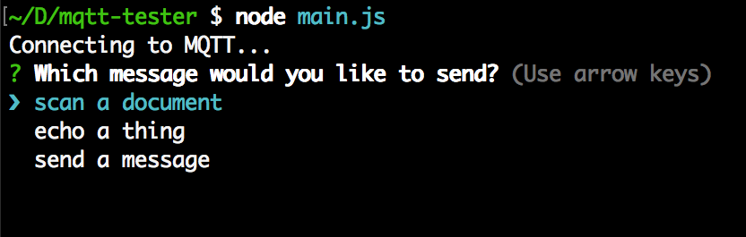

Sometimes when you're working on an MQTT system, you want to trigger various different messages for testing. This tool lets you define a list of messages to send on various topics with different data. It then repeatedly asks you which you'd like to send.



Copy the `config.example.yaml` to `config.yaml` and put in your MQTT connection information and configure a list of messages to choose between. Then just run `node main.js` to get started.

```
mqtt:
  url: http://127.0.0.1
  options:

messages:
  - name: send a message
    topic: messages
    data:
      yourDataHere: describe the JSON object you want to send in YAML
      or: {"in" : "JSON"}
```
